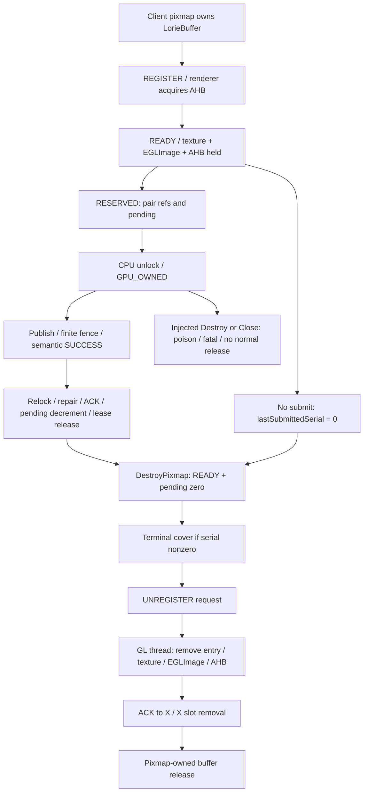

# R8 Destroy / Close lifecycle design

Status: **PROPOSED**. This is a source-backed design proposal, not a qualification or a change to frozen historical contracts. New decisions are adopted only through an explicit design acceptance record. Current base and product bindings are in [README](README.md).

## 1. Authority and bounded research

Only merged current handoff, the R8 sections of A06/A07, the B4 implementation record, frozen R7 hook/judge, relevant Present retirement excerpt and decisive current source symbols were read. IDs refer to [the merged authority index](../v1-core-20260917/AUTHORITY-INDEX.md). Main advanced only by PR #7's six planning files; no new runtime claim was discovered.

FROZEN requirements from A06/A07: clean Destroy/Close, Present window-destroy/disconnect, register without submit, capacity, deferred record delivery, synthetic pending Destroy/Close; exact pixels, no premature release, no unexpected fatal, resource balance and Stable isolation. D-9 permits synthetic direct-pending hooks because normal client dispatch cannot interleave synchronous Prepare→Done. **It does not authorize manufactured completion evidence for R8-D.**

The R6 `core-src/present_vblank.c` excerpt is insufficient for current event36 behavior. The exact product `patches/xserver.patch` was checked instead: event36 is emitted before the terminal wait and ACK. Source blobs and anchors are listed in §10.

## 2. Acceptance decisions to adopt

| ID | Prior ambiguity | Proposed R8 disposition |
|---|---|---|
| R8-A01 | A07 says ACK then RESOURCE_DESTROY; B4 and source destroy first | Renderer removes the READY entry, deletes texture, destroys EGLImage, releases imported AHB, emits26, then sends ACK. X receives ACK then removes its slot and releases the owning pixmap/buffer. Record this as an explicit correction to the R8 oracle, never rewrite A07 history. |
| R8-A02 | Logged SEND/ACK order can race actual transport | Require source-proven send/receive causality plus role-bound markers. Do not require X24 before renderer26, renderer25 before X25, or X27 before renderer28. Renderer26 **must** precede X25 for that buffer in the complete shared telemetry sequence. |
| R8-A03 | K pairs vs slots | X registry16 and renderer READY16 are **buffers**; pending import8 is a different queue. Register sequentially. Account actual baseline occupancy. Capacity fixture requires no unrelated registrations and fails preflight if baseline is not controlled; never assume eight pairs independent of root. |
| R8-A04 | No C4 register-only fixture | Add a test-build-only X registration control described in fixture-interface. It calls the actual sampleable/READY helpers on client-owned pixmaps but never Composite, reserve, unlock, submit or fallback. The Gate A wire/shared structures remain unchanged. This is an explicit new **test control interface**, not an existing capability. |
| R8-A05 | P1 hook calls fatal directly | On the R8 support candidate only, fault14's consumed branch invokes real `lorieExaDestroyPixmap` on the leased source private object. Its actual guard must fatal7 before any release. An unexpected return produces a distinct failure marker/exit, never the expected fatal. Fault15 already calls real `gateACloseGeneration`. |
| R8-A06 | Totals do not show live pending or settled renderer cleanup | Add observation-only snapshots outside frozen ABI: actual registry entries, buffer pending, root pending, active lease, queue state and role-specific final resource state. c11 is never a live-pending gauge. Required missing snapshot means INVALID, not zero. |
| R8-A07 | D overlap not guaranteed by a busy client | Use a bounded real Present/free workload with per-record DEFER and later DISPATCH evidence; require at least one real GPU_COPY_DONE to enter DEFER within UNREGISTER wait. No overlap means INVALID_CONSTRUCTION. Host tests deterministically exercise the real parser/deferred queue, but cannot substitute for this device claim. No forced renderer delay or synthetic completion is permitted. |
| R8-A08 | ownerRef/root obligations may be implicitly waived | R8 proves the explicitly tested offscreen pixmap and Present lifetimes only. Owning pixmap stays live until actual destructor; active pair adds refs/pending; renderer owns an independent imported AHB ref. No general ownerRef or root READY equivalence is accepted by this PR. Root resize, failed-register DEAD-entry retirement and broader production lifecycle remain separate blockers, not assumed closed. |
| R8-A09 | event36 mistaken for completed/retired | event36 says helper entry with a sampled waited bit. Require a pre-ACK observation of covering completion in the same session/serial and a post-ACK pending-clear observation. Both waited0 and waited1 are legal; completion may race between the two existing IsDone calls. |
| R8-A10 | Clean Close blanket “no signal” | A verified harness-issued TERM can request the X server's normal shutdown path. Require clean CloseScreen/closed/unbind evidence and no signal-caused abnormal termination. Record actual observable exit status; never relabel cleanup-killed X as clean close or invent exit0 from process absence. |

All ten decisions are PROPOSED and individually reviewable. Accepting them does not authorize implementation. If source implementation cannot follow the constraints without a new lifetime/protocol rule, return a minimal design amendment; do not broaden the implementation silently.

## 3. Ownership and lifetime

| Resource | Owner / protection | Clean release | Pending/fatal rule |
|---|---|---|---|
| X pixmap / LorieBuffer | Pixmap private object; real destructor owns its final reference | After Gate A UNREGISTER acknowledgment, then legacy unregister and buffer release | Destructor overlap guard must execute before retire/unlock/release/free |
| Direct source | Pair acquires a buffer ref and pending count before unlock | Only successful Done ACK then pair metadata release | No post-hook ACK, pending decrement or release |
| Direct destination | Extra ref/pending for non-root; root has special root pending accounting | Success-only ACK; root tests require their separate ownership scope | No inferred root-ownerRef proof |
| X registry / waiter | Stable slot protected by registry mutex; pendingCount tracks active pair | READY/pending0 → RETIRING → matching ACK → UNREGISTERED → slot removal | No removing REGISTERING/DEAD/nonzero pending as though clean READY |
| Renderer import | Independent imported AHB ref, EGLImage, texture; GL thread destroys | Texture → EGLImage → AHB release, then ACK | Process death is not evidence of graceful per-resource accounting |
| Present vblank | Existing Present retirement helper and source/destination refs | Terminal covering S before Ack, pending clear, idle and destruction | Completion racing early is legal; unexplained absence of the scheduled COPY is INVALID |
| Deferred record | Parser-owned record copied to the existing dynamically allocated WorkProc queue with tuple; no numeric queue capacity is claimed | Exactly one later dispatch for DEFER; generation-close CANCEL is distinct | No FD/payload duplication, cross-generation dispatch or invented GPU_DONE |

Normal direct work has already completed synchronously when a subsequent client FreePixmap is dispatched. Therefore P1/P2 are **synthetic in-thread guard tests**, not proof of an externally reachable concurrent client sequence. Strengthening P1 to call the actual destructor makes the guard observable without claiming natural reachability.

No new mutex is held across socket I/O, waits or log writes. Capture fields under their existing owner/leaf lock, release lock, then emit the copied observation. Renderer READY/pending/control arrays remain under `gateAImportMutex`; X metadata under `gateARegistryMutex`. Existing acquire/release publication helpers stay unchanged. Test controls never change completedSerial, generationFatal, result or pending to arrange a PASS.

## 4. Semantic partial-order oracle

For buffer B in session N/G and last submitted serial S:

1. X owner is still live; metadata READY, pending0 and no active overlapping pair.
2. If S != 0: fatal-first SUCCESS/covering terminal evidence for S; if S == 0: **no terminal wait invocation**.
3. Actual UNREGISTER send precedes renderer receipt by transport causality. X24 is logged **after** send, so it is not an order anchor for renderer26.
4. Renderer takes matching READY entry and destroys GL resources on the GL thread; resource observation then event26.
5. Renderer sends UNREGISTER_ACK. The existing renderer25/c19 decrement happen **after** send and can trail X receipt; they are not an ownership handoff precondition.
6. X25 matches N/G/B; real registry removal completes before pixmap owner is released.
7. Require renderer's later settled observation after its diagnostic decrement, plus X post-removal observation. Do not read one early summary and call both registries zero.

Use shared Gate A sequence for its events; sideband observations have per-producer sequence only. No sorting of wall timestamps creates a cross-thread happens-before proof. Bind sideband to producer, original tuple and buffer/serial, and assert program-location ordering verified by static tests. Duplicate captures with identical event sequence/payload may be deduplicated; conflicting duplicates or unrepaired gaps invalidate qualification.

For clean Close:
- `gateAClosing` stops new admission; no active pair; wait/drain current serial, queue read==write and no failed/fatal state.
- Retire every snapshot entry; registry snapshot capacity16 must equal the actual array capacity.
- Cancel previously deferred legacy records under the existing CANCEL policy; record dispositions separately from D's DEFER→DISPATCH requirement.
- GENERATION_CLOSE → renderer empty-registry check → CLOSED send → renderer unbind.
- X sees CLOSED and zeros shared nonce/generation; this can precede renderer's post-send unbind. Require **both** X close result and renderer final UNBOUND observation before aggregate acceptance.
- Preserve original N/G in observation values copied before zeroing; a zero-tuple summary cannot independently bind the attempt.

Renderer final observation is captured externally even if X already exits. No new ACK, sleep or change in resource order is added just to make counters align. Missing final evidence within the fixed harness collection deadline is INVALID; never reread an old summary file from a prior session.

## 5. Exact cell scope and construction

[lifecycle-cell-spec.json](lifecycle-cell-spec.json) is the machine-readable sequence; [fixture-interface](fixture-interface.md) defines the proposed CLI. Ten cells, each once with fresh X, unique output directory and exact candidate binding.

- **C1:** one exact direct on retained offscreen BGRA/RGBX pair; FreePicture references before final FreePixmap so real destructor runs, source then destination. Observe both retired. A new distinct pair then exact direct SUCCESS. Final frees and clean close.
- **C2:** same direct but deliberately retain client pixmaps until normal X termination/CloseScreen, so teardown actually has registrations to drain. Do not let client disconnect free everything first and call an empty close the tested path. Dedicated helper remains connected until X closes; ordinary holder can leave. Request verified X TERM once; prove CloseScreen retires the recorded live IDs. If xserver normal shutdown destroys these resources before CloseScreen instead, construction is INVALID for this claim and requires a documented construction amendment, not a fake live-at-close assertion.
- **C3-window/disconnect:** force an actual ASYNC|COPY Present path, not flip/software fallback. Submit request then destroy window/disconnect without awaiting completion. Require COPY scheduled identity and helper evidence; waited0 or1 legal. Destruction can precede Present scheduling; that is INVALID_CONSTRUCTION, not a pass. A separate observer/survivor verifies server health and a later direct exact SUCCESS; a disconnected/destroyed recipient is not required to receive impossible CompleteNotify.
- **C4:** client creates pair; test registration control calls real READY path for each buffer; no Composite request at all. lastSubmittedSerial0 on each; no reserve/unlock/publish; FreePicture/FreePixmap then actual destructor. Terminal-wait entry is forbidden for these IDs.
- **C5-full:** same test control registers exactly the number of free buffer slots, sequential READY replies, keeping all pixmaps live; require full16 at X and renderer, pending import queue drained. Retain registrations for normal close. Avoid large event streams or unqualified 16-pair interpretation.
- **C5-overflow:** fill16; actual Direct Prepare using one registered BGRA source and a fresh RGBX destination must return pre-lease refusal from full registry and complete exact via existing fallback. It may use an existing eligible legacy GPU path; do **not** forbid all GPU commands and thereby falsely reject valid fallback. Require **no Gate A direct lease/unlock/publish for refused pair**. Free one registered RGBX slot; admit the previously refused destination, perform fresh direct exact SUCCESS, then normal cleanup. This proves capacity recovery, not renderer-only overflow or REGISTER_FAILED cleanup.
- **D:** dedicated Present connection and separate retained Gate A pair; 8 real Present ASYNC|COPY requests, each with unique Present serial. Following fixture's interleaving schedule, FreePixmap both pair endpoints while Present stream is active. Each Present remains on a live window/connection until its notification. Require real COPY_DONE record parsed during an UNREGISTER wait with DEFER policy, later dispatched exactly once and corresponding Present notifications equal submitted accepted requests. No deferred event means INVALID, even if all pixels/notifications are fine. Natural race is not guaranteed; this limit is explicit.
- **P1/P2:** existing exact fault14/fault15 environment; one direct fixture invocation. event5 → event35 (same pair, generation, serial0 before first publish). P1 must enter actual destructor guard, P2 actual close-drain guard. Expected x-destroy-in-lease/7 or x-close-in-lease/8; no unregister/closed/normal release. Frozen judge is retained and supplemented because it accepts event2 alone.

C2/C5-full construction is a checkable requirement rather than an assumed consequence of sending TERM. The implementation package must demonstrate the actual xserver termination path on the pinned submodule and supply a host call-order regression before runtime. If normal shutdown cannot reach CloseScreen with live slots, **do not mutate production teardown order** to force it; design a separately reviewed synthetic clean-close cell while preserving the real shutdown smoke as a distinct claim.

`EVENT_GPU_COPY_DONE` is a payload-free wakeup, not a per-Present completion record. `notifyGpuCopyDone()` is also called on surface loss. D must separately bind a successful post-fence renderer wakeup send to the same connection's ordered receive, then prove its X-local record ID was deferred and dispatched. Preserve all successful wakeup send/receive ordinals to make that correspondence checkable without adding wire fields. Require completedSerial coverage and Present notification identities independently; one wakeup can cover several submissions. A surface-loss wakeup or missing send/receive correspondence cannot satisfy the completion-origin claim. The host synthetic record tests only parser/queue behavior.

## 6. Observation support

New observations are **test/diagnostic output only**, described in fixture-interface. They do not reuse event numbers37+ or add counters to the frozen28/40-byte fault tail.

Minimum anchors:
- X: case binding, checkpoint registry rows/state/lastSerial/pending/cpuLocked, pair state/IDs, actual per-buffer pending and root pending; before/after destructor, terminal-wait entry, successful slot removal; CloseScreen entry including live IDs, close result.
- Renderer GL thread: import/READY occupancy and pending controls; destroy stages, after-ACK diagnostic settlement, final registry/resource snapshot, original tuple and post-close bound=false.
- Present helper: window/client request identity ↔ GPU serial and destination; entry with waited sample; PRE_ACK with completed watermark and fatal/failed state; POST_ACK with pending flags/counts and subsequent idle/destruction order. Do not dereference freed resources for a later snapshot; copy IDs before release.
- Deferred queue: successful enqueue and successful dispatch/cancel, record type, identity from actual parsed payload, queue count before/after, active wait kind, original N/G. No empty/attempt marker counts as successful enqueue.
- Test control: consumed operation/case/client/XID identity; own-client resource validation; result and observed capacity; no release of client-owned refs by the control command.

Live per-buffer pending needs an accessor to the actual internal field (read on X owner thread); do not compute it by decrement totals or by unsafe casts. Add only a read accessor and owner-thread observation. Use copied IDs/counts before object release. Per-role monotonically increasing diagnostic sequence and BEGIN/END count/digest detect lost observations. Missing required output invalidates the cell. The exact transport may be bounded logcat/raw launcher capture with strict completeness; no assertion of a recorder that has not been implemented.

No retry is triggered by observation loss. The support implementation must demonstrate no OFF-mode or unarmed behavior change, no extra GPU delay, no extra waiter/pump semantics and no test admission in Stable/non-test builds.

## 7. Judges, false green and false red

New `judge-r8.py` must execute real parsing and predicates. It consumes a bound manifest plus raw trace/diagnostic/client files, not a trusted client-supplied `passed=true`. It must preserve frozen `judge-r7.py`; for P1/P2 both judges must pass. Exact proposed CLI/exit classification is in fixture-interface.

[judge-negative-cases.json](judge-negative-cases.json) includes valid controls and mutations for: early ACK, wrong role/tuple/object, missing prefix, duplicate conflict, no hook, missing GPU_OWNED, direct fatal stub instead of destructor, zero-serial terminal wait, early/late Present completion, valid fallback, missing overlap, wrong resource balances, premature snapshot, real CloseScreen empty construction and clean requested TERM.

Actual totals are **not** required to equal the two direct endpoints globally when Present/other legitimate work exists; identify per-cell targeted IDs and compare complete final state. Every required resource must return to zero at final clean generation close. No full R10 “no leak” claim follows from these ten short R8 cells.

Expected outcomes: PASS / FAIL / INVALID / BLOCKED are distinct; expected P fatal is PASS only with exact construction and forbidden-event absence. Host oracle PASS does not certify device implementation. No current R8 runtime verdict is assigned here.

## 8. Scope exclusions and prerequisites

Unchanged: Stable `com.termux.x11 :1`, display0/HDMI policy, 2000ms product waits, 8ms CASE_LOOP recovery, exact pixels, shared queue168/frame40/direct-meta48/fault-tail40, events1–36, counters28, no post-publish fallback.

New source is confined to an accepted R8 support candidate. It requires full host verification, reviewed regression selection, fork CI, artifact qualification, separate install and runtime grant. R7 overall must close before R8 runtime. Because source/observability/fault14 are changed, do not run the old fdfb1ce-bound runner under a renamed artifact. Use a new generic R8 runner with exact manifest validation.

R7-04 and B-2 are not automatically rerun: use touched-semantics analysis in [IMPLEMENTATION-PLAN](IMPLEMENTATION-PLAN.md). If implementation alters normal admission/ownership/scheduling, the minimal-support assumption is broken and wider requalification must be approved.

## 9. Review / completion

Design acceptance must record R8-A01…A10 and test control exposure/disable rules. Implementation delivers real tools and source-bound host evidence, resolves any construction amendment before runtime, and cannot claim success merely by creating their filenames. Runtime aggregate requires all ten PASS plus artifact binding, complete observations, expected process outcomes, Stable unchanged and actual process/socket cleanup.

This design contains a deliberate fail-closed limit: natural D overlap and C2/C3 live-state construction may fail to occur. The accepted judge must say INVALID_CONSTRUCTION and stop, not manufacture a schedule. Further attempts or a different construction need a fresh explicit grant and design amendment when semantics change.

## 10. Minimal decisive evidence

All product links are pinned to `fdfb1ce44b429897eda17c43bf33fbd37afe67f3`; local downloaded file bytes were verified against GitHub blob SHA.

| File / blob | Relevant lines / source fact |
|---|---|
| [InitOutput.c](https://github.com/waydefu/termux-x11/blob/fdfb1ce44b429897eda17c43bf33fbd37afe67f3/lorie/src/main/cpp/lorie/InitOutput.c) / a90c0a5e07e197d871ece757a079671b76f60b1b | 1216–1238 close before root destruction; 1864–1910 scalar done/ACK/Present wait; 2668–2718 READY; 2902–3000 pre-lease admission; 3062–3153 retire/close; 3229–3244 hooks before publication; 3685–3704 real destructor |
| [renderer.cpp](https://github.com/waydefu/termux-x11/blob/fdfb1ce44b429897eda17c43bf33fbd37afe67f3/lorie/src/main/cpp/lorie/renderer.cpp) / 3513d7377dfb79a72dbbfe0960141a3312c48355 | 162–185 capacity; 363–372 post-send marker/counter; 397–418 reverse destroy; 691–751 control drain/destroy→ACK/CLOSED→unbind |
| [cmdentrypoint.cpp](https://github.com/waydefu/termux-x11/blob/fdfb1ce44b429897eda17c43bf33fbd37afe67f3/lorie/src/main/cpp/lorie/cmdentrypoint.cpp) / 0e6f50ceef76a2db7bd6feee87bdad5f79d38e62 | 109–155 insertion; 275–329 retirement state; 619–658 tuple and ACK handling; deferred pump/queue paths located by symbols in fixture-interface |
| [activity.cpp](https://github.com/waydefu/termux-x11/blob/fdfb1ce44b429897eda17c43bf33fbd37afe67f3/lorie/src/main/cpp/lorie/activity.cpp) / cb6b14e30592cc44e158f2d386f87dcdc5023346 | 140–166 protected tuple read/unbind; 174–204 rebind policy |
| [lorie.h](https://github.com/waydefu/termux-x11/blob/fdfb1ce44b429897eda17c43bf33fbd37afe67f3/lorie/src/main/cpp/lorie/lorie.h) / d9be6c78faa960d5b259b74c009c9b3e3f0246a2 | 348–440 frozen event/counter enums; existing acquire/release/ABI contracts |
| [current xserver.patch](https://github.com/waydefu/termux-x11/blob/fdfb1ce44b429897eda17c43bf33fbd37afe67f3/lorie/src/main/cpp/patches/xserver.patch) / 0381c7ad2bff916f9e9b52f14141186e969138fe | 660–683 real Present helper: event36 before IsDone/wait and ACK |
| [buffer.h](https://github.com/waydefu/termux-x11/blob/fdfb1ce44b429897eda17c43bf33fbd37afe67f3/lorie/src/main/cpp/lorie/buffer.h) / a55b4efad79a86acf4a775d9aaee029c05ff91bd | 117–126 existing pending mutation/boolean API; no numeric getter supplied here |

Repo authority: [A06 R8 contract](../../evidence/session/gate-a-a1/GATE-A-P2-RUNTIME-QUALIFICATION-DESIGN-20260913.md), [A07 §5 / D-9](../../GATE-A-R6檢查與R7-R10-GateH計畫書-20260915.md), [B4 implementation](../../evidence/session/gate-a-a1/GATE-A-P2-B1-B4-IMPLEMENTATION-20260914.md), [frozen judge](../../evidence/session/gate-a-a1/p2-r7-design/judge-r7.py), [NEXT-014](../v1-core-20260917/EXECUTION-PACKETS.md#next-014). Old ACK→destroy text remains historical; this proposal records its disposition explicitly.
