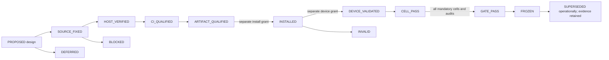
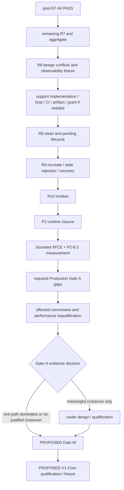
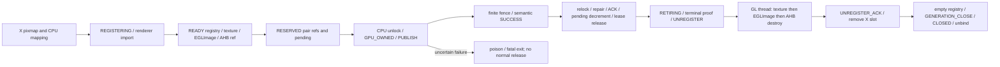

# V1-Core master execution architecture

## Current Authority Header

- Research date: 2026-09-17 Asia/Taipei. Actual fetched base: **`c95b893ea161d5aacb7b633495b1751ac97182b7`** (`waydefu/GPU/main`). New branch: `docs/v1-core-master-plan-20260917`.
- PR #6 is MERGED, merge SHA equals this base. PR #5 is the preceding B-2 PASS authority. No newer merged handoff was found at research time.
- Product source inspected read-only at **`fdfb1ce44b429897eda17c43bf33fbd37afe67f3`** in `waydefu/termux-x11`; it is not the GPU documentation SHA. Exact source links and evidence paths are in [AUTHORITY-INDEX](AUTHORITY-INDEX.md).
- **FROZEN** denotes adopted contracts/historical evidence; **DEVICE-PROVEN** is used only for recorded hardware results; **SOURCE-PROVEN** does not imply runtime qualification. Every new architecture, acceptance rule, packet organization, or unresolved resolution below is **PROPOSED** until accepted. This whole plan is PROPOSED; quoted FROZEN obligations retain their authority.
- No live device was inspected. “INSTALLED” describes merged evidence, not a new live assertion. No production source, frozen judge, harness, evidence, or prior status file is changed here.

## Scope

Build the shortest evidence-complete path from post-R7-04 to a qualified, limited V1-Core desktop GPU implementation. Supply mechanical execution for frozen cells, explicit design outputs for unresolved lifecycle work, and artifact-specific requalification instead of automatic whole-project reruns.

## Deferred Scope — Deferred After V1-Core

V1-UWQHD; dedicated 3440×1440@60; UWQHD 90/120 Hz; Full Global GPU; general mask, arbitrary transform, general bilinear, repeat, componentAlpha and global/two-pass XRender coverage. Full Chromium GPU coverage, browser acceleration claims, seamless continuation of already poisoned sessions, and broad compositor optimization are not implicit requirements.

## Authority Ladder

Current `waydefu/GPU/main` → newest merged status/handoff PR → current STATUS-HANDOFF → CONTINUATION → frozen gate/design contract → frozen judge/verifier/harness → captured device evidence → exact source/worktree map → older plans → new inference. If a lower layer contradicts a frozen contract, record a conflict and block the affected future packet; do not silently rewrite either. Source is used to discover testability, not to retroactively turn FAIL into PASS.

## Current Proven State

| Claim | Authority / exact limitation |
|---|---|
| R6 PASS / FROZEN | `0f1e54699d0b11a781f2c044fbc77505f8a53bd8`; historical device qualification, not a new full R6 run on `fdfb1ce` |
| RCA-1 FIXED / DEVICE-PROVEN | `0d72332` timeout→Done correction retained; its separate B-2 failure remains historical |
| CASE_LOOP DEVICE-VALIDATED | `7549e3667ec03b8b5e50d2e5befe03065840bbd9`, 8 ms CLOCK_MONOTONIC recovery; initial `327b028` SUPERSEDED |
| B-2 PASS | `b2-requalification-02`, X 32228; oracle 1514/1514, stress 100/100/1000, no timeout/fatal; requalification-01 INVALID remains frozen |
| Candidate | `fdfb1ce`, parent `7549e36`, CI 35103216566; experimental installed record and APK binding in A01/A10 |
| R7-04 CELL_PASS | new X 9891; `R7_04_REQUALIFICATION_PASS`; frozen judge returns `R7_PASS fbo-incomplete` |
| Remaining | R7 IN PROGRESS; R8/R9/R10 not run; Production Gate A BLOCKED; Gate H HOLD |

## Historical/Frozen State and Stale Document Warnings

`7549e36` R7-04 X 31122 remains VALID FAIL: renderer reason=2 overwritten by X `x-direct-not-success reason=4`; current repair preserves published `generationFatal`. Same frozen judge still fails the old evidence. R5 logcat ACK capture loss was explicitly accepted in its own historical gate; that exception cannot excuse missing R7 fault traces or R10 counters.

Do not copy the status header of the 20260915 plan: R6 NOT PASS, R7 source-blocked, B-2 BLOCKED, and pre-`fdfb1ce` installed assertions are superseded by A01–A03. Its accepted D-1…D-9 decisions and R8–R10 specification remain relevant where not superseded. The CI provenance file’s “not installed” describes artifact qualification time only. AGENTS’ Linux project-root description is historical layout guidance; this GitHub docs repository is a real Git repository. Old Adreno 830 and sub-millisecond timing prose is not a current hardware/performance measurement.

## EXECUTOR-GLOBAL-HARD-RULES

1. Never mutate `com.termux.x11`, display `:1`, Stable processes/configuration/APK, or HDMI. Only authorized `com.waydefu.x11gpu`, `:3`, Android display 0 work is eligible.
2. Never overwrite evidence, including an INVALID attempt. Check the destination **before invoking** the current runner: its existing-directory refusal itself writes `primary-verdict.txt` and its EXIT trap performs cleanup. A read-only preflight must therefore refuse existing directories and preexisting X3 before launching it.
3. Never silent-retry, extend 2000 ms for PASS, change the 8 ms recovery cap, weaken a judge, erase historical FAIL, or continue a poisoned generation. Each new attempt needs a new evidence identity and explicit grant.
4. Never equate ZIP digest with APK SHA256, version name with full provenance, source fix with device validation, a cell PASS with R7 PASS, or P2 closure with Production enable.
5. Missing/overflowed required evidence blocks qualification. `not_observable`/`null` is never zero. An env setting is not positive proof a hook fired. Judge output is necessary but does not excuse failed binding/safety/cleanup checks.
6. Preserve queue 168 B, frame/sideband 40 B, direct metadata 48 B, append-only event numbers 1–36, 28 counters, R7 fault tail 40 B. ABI changes require a separate design decision and paired builds.
7. Never mix R6 OOM/Present requeue env with R7 fault env. Never leave experimental XFCE/xfwm as a daily session. No `logcat -c`, broad `pkill`, or stale ADB endpoint assumptions.
8. Future device work uses ADB SOP A12, isolated lane 5038; do not disturb 5037. Fetch connection identity live; record no pairing credentials in Git. Kill only a verified exact experimental cmdline/PID, holder/fixture/logcat belonging to that cell.
9. Never push/PR/merge upstream `termux/termux-x11`; fork source work, CI, install, and runtime are distinct future authorizations. This PR authorizes none. Do not merge this docs PR automatically.
10. One writer/independent worktree; at most two read-only scouts per AGENTS. Escalate only the decisive ambiguity, with evidence. Read-only rejudging needs no new device grant; it must not invoke a runtime runner.

## Global Invariants

| ID | FROZEN invariant / review obligation |
|---|---|
| INV-A01 | Stable isolation and explicit runtime/artifact authorization; fresh identity and immutable evidence |
| INV-A02 | Owner identity is `(sessionNonce, generation, bufferId, fingerprint)`; fresh X nonce differs even if generation restarts at 1 |
| INV-A03 | serial is generation-local nonzero u64; consumed/readIndex is not completed; terminal watermark covers `T >= S`; wrap never publishes 0 |
| INV-A04 | `present_gpu_copy_retire_or_fatal` is sole Present ACK site; terminal cover precedes ACK, pending clear, idle, and destruction; event 32 remains unused |
| INV-A05 | `RESULT_FATAL`/`generationFatal` wins over scalar completion; first failure sticky; `fdfb1ce` does not emit conflicting second fatal identity |
| INV-A06 | Post-publish failure never relocks, repairs, ACKs, decrements pending, releases lease, falls back to D0a, or replays; fail-stop `_exit(127)` is expected, signal is not |
| INV-A07 | Terminal/Present wait budget remains 2000 ms; never dispatch X clients inside wait; record-aware transport pump only; no retry loops to pass |
| INV-A08 | CASE_LOOP wake recovery remains 8 ms CLOCK_MONOTONIC; no sleep/delay injection to manufacture overlap |
| INV-A09 | Fault FAULT/ARM validated in X, PROTO=TELEMETRY=1; shared tail CAS consumed 0→1 before event 35 before replacement; renderer does not getenv fault |
| INV-A10 | Shared ABI sizes above fixed; release publication/acquire observation must retain payload-before-state ordering; no ad hoc atomics |
| INV-A11 | CPU mappings absent while pair GPU_OWNED; references/pending protect both endpoints until SUCCESS; RESERVED rollback only before unlock/publication |
| INV-A12 | SUCCESS, fence satisfaction, ACK, endpoint pending decrement and lease release are distinct events; counts and same-transaction order both matter |
| INV-A13 | Renderer death/HUP poisons active generation and wakes failed waiters; X death cannot justify continued old-generation work; process death is not graceful resource accounting |
| INV-A14 | Clean teardown blocks admission, drains, unregisters, destroys GL resources on GL thread, ACKs, closes generation and unbinds; fatal teardown bypasses normal release |
| INV-A15 | UNREGISTER wait DEFERs legacy records; generation close CANCELs them; queued records/FDs cannot cross a generation |
| INV-A16 | Reconnect/replay never accepts old READY, completed serial, fatal state, registry entry or mapping as new work; fresh-session recovery must be proven |
| INV-A17 | Predicate stays narrow and exact pixels stay exact; safe pre-lease refusal may fall back, post-lease ambiguity may not |
| INV-A18 | Finite fence must succeed before completed publication. No missing timestamps interpreted as GPU duration; R10 ownership counts are separate from RSS |

## Project State Machine

`SOURCE_FIXED` means a bounded committed candidate, not proof of behavior. `HOST_VERIFIED` requires real-source tests/static verification. `CI_QUALIFIED` binds a successful run to exact SHA; `ARTIFACT_QUALIFIED` binds package/ELF/signer. `INSTALLED` requires read-back. `DEVICE_VALIDATED` describes only measured claims; `CELL_PASS` additionally needs contract completeness. `GATE_PASS` requires the aggregate, approved carry-forward and cleanup. `FROZEN` preserves evidence, not perpetual qualification of descendants. `BLOCKED` is an unmet dependency; `INVALID` is unusable qualification. `SUPERSEDED` does not erase a valid historical FAIL. `DEFERRED` is deliberately outside this release.

## Dependency Graph

The production gap **audit/design** may proceed read-only alongside R8 planning. Its mutations must wait for their own grants. D-1 surface-stall correction must precede any cell that claims background/resume support; it need not reopen the already frozen R6 historical verdict. When a required correction changes ownership/Present/generation, use the requalification table, then refresh performance on the final candidate. Do not run a knowingly invalid test merely to keep the drawn order.

## Minimal V1-Core Critical Path

| Item | Category | Minimal obligation |
|---|---|---|
| Remaining R7 | MUST BEFORE V1-CORE | 12 remaining cells, fail-fast; R7-04 carry-forward already explicit |
| R8 / R9 / R10 | MUST BEFORE V1-CORE | Clean lifetime, rejection/recovery, resource accounting; support gaps closed first |
| Bounded XFCE | MUST BEFORE V1-CORE | Current artifact smoke and Gate W, old 45 s proof alone insufficient |
| P2-B.3 | MUST BEFORE V1-CORE | Comparable real-workload evidence; no automatic speedup claim |
| Production lifecycle / D-1 | MUST BEFORE V1-CORE | Supported surface-loss/resume and clean close/fresh restart safe; redesign only necessary gaps |
| Registry LRU | CAN DEFER | Safe full-pool refusal/recovery mandatory; eviction optional unless workload proves unusable without it |
| ownerRef | CONDITIONAL | Lifetime proof mandatory; adding this field’s ownership mechanism only if current pair/pixmap refs cannot prove safety |
| Root resize | MUST BEFORE V1-CORE | Correct normal desktop resize, drain and re-registration or safe pre-admission fallback; no dedicated UWQHD |
| ROOT_READY protocol expansion | CONDITIONAL | Add only if existing resize/root behavior cannot satisfy supported release contract |
| Gate H router | CONDITIONAL | H3 stable meaningful crossover; never guessed threshold |
| D0b | CAN DEFER | STILL UNSAFE for current implementation; not a release dependency |
| Gate W | MUST BEFORE V1-CORE | New minimal workload contract must be accepted and executed |
| Chromium / Cursor | CAN DEFER | Named app/GL acceleration certification is separate; browser-like damage fixture suffices for this core scope |
| V1-UWQHD / Full Global GPU | CAN DEFER | Explicitly excluded |
| R6 / B-2 / R7-04 | ALREADY CLOSED | Retain original artifact binding; new touched semantics may require targeted requalification, not historical reruns |
| P0/P1/P2-A/P2-B.1/P2-B.2 | ALREADY CLOSED | No reopening as a renamed performance gate |

## R7 Remaining Strategy

NEXT-001…012 follow A04/A05 and [cell matrix](CONTRACT-DETAILS.md#r7-cell-matrix). One fresh cell per grant unless a grant explicitly names the whole ordered batch. No CI/reinstall for unchanged `fdfb1ce`. No R7-04 or B-2 rerun by default. A local rejudge of existing logs is not a runtime rerun.

R7-05 is FAILED_QUIESCED followed by X `x-direct-not-success reason=2`; it must **not** suppress that X fatal by imitating the R7-04 repair. R7-09 may die on inbound READY before direct publication. R7-11 must never publish zero. Present P1/P2 use the Present fixture, not a direct-only oracle. P1 timeout does not license changing the 2000 ms wait.

NEXT-013 aggregates mandatory evidence, checks artifact lineage/carry-forward, and stops before R8. Ordinary failure uses NEXT-037; only unresolved protocol/ownership/conflicting contract issues escalate.

## R8 Architecture

FROZEN intent: clean Destroy/Close, Present window-destroy and disconnect, register-without-submit, capacity, deferred record delivery, and synthetic pending Destroy/Close (A07 §5, accepted D-9). Current B4 implementation is SOURCE-PROVEN, not R8 DEVICE-PROVEN.

Reference lifetime: X pixmap owns its buffer; active pair takes additional refs/pending for both endpoints; renderer READY import independently holds AHB+EGLImage+texture; pool-stable X waiter survives until acknowledged removal. Renderer process lifetime does not replace per-import retirement. `CloseScreen` closes the generation before root pixmap destruction.

**[H] DESIGN REQUIRED at NEXT-014:** A07 C1 writes ACK→RESOURCE_DESTROY, but current `gateADrainPendingControls` does RESOURCE_DESTROY→ACK (the safe ownership order). Also X SEND event is logged after socket send, so renderer destroy may be recorded before the X SEND marker. A reviewed partial-order oracle must distinguish logical send from its late diagnostic marker; do not alter the frozen contract silently. Capacity is 16 buffers, renderer pending imports 8, not 16 pairs. Existing 28-counter summary lacks a live pending gauge. C4 has no existing user-facing register-only fixture. Warm R9 needs cleanup that retains Activity; current R7 runner always force-stops it. No existing R8/R9/R10 dedicated judge/harness was found. See exact blockers and subcells in CONTRACT-DETAILS.

Divide work into R8-DESIGN NEXT-014, R8-IMPLEMENT NEXT-015, R8-VERIFY NEXT-016, R8-CI NEXT-017 (only product diff), R8-DEVICE NEXT-018. Only reviewed mechanical implementation/verification becomes [L]. Do not add a new ABI for convenience.

## R9 Architecture

R9 means **fresh X + session nonce**, warm/cold Activity reuse, Gate A registry cleanup/rebind, stale READY rejection, then fresh recovery. It is not merely AHB/Pixmap allocation, not automatically same-process renderer hot-swap, and not a root-resize certification. R9-3 same-X reset is conditional on reachability; current `OsVendorInit` returns when mapping exists, while clean close zeros tuple. Source alone does not prove reset regenerates nonce. Confirm xserver reset path and launch flags before enabling that cell.

| Hazard | Required proof / source boundary |
|---|---|
| old completion retires new serial | queue mapping and `(nonce,generation)` binding reset; never compare serial across sessions |
| old registry reused / AHB identity collision | tuple+bufferId+fingerprint checked; occupancy zero before new admission; no equality by ID alone |
| stale fatal inherited | protocol initialization only after old owner is drained/terminated; cannot clear fatal to resume old work |
| old renderer publishes after recreate | clean CLOSED/unbind before new mapping; busy rebind fail-stops; keep old work from reaching new queue |
| stale serial retires new work | Present helper terminal evidence belongs to same mapping/generation; cross-session negatives in new lifecycle judge |
| stale READY accepted | existing R7-14 sends synthetic `(nonce-1,generation-1)` after valid READY; it does not capture and replay an actual prior-session frame |

R9-F1 can prove synthetic tuple rejection with existing hook. Historical “no READY_MARK” means **no READY caused by stale frame**, not zero legitimate READY globally: current hook sends a valid READY first. Testing actual recorded replay or reused IDs requires a reviewed fixture, not relabeling this hook. NEXT-019 settles these construction questions; NEXT-020 runs warm 3, cold 3, conditional same-process, F1 and F2 exactly once each.

## R10 Architecture

FROZEN A06/A07: at least 5 clean rounds after R9, logical balances zero at teardown, no monotonic FD growth at equivalent K0/K2, no X3 residue. K0 bind/pre-direct, K1 fixed repeated direct, K2 after all FreePixmap, K3 after clean close. Proposed freeze: 3 warm + 2 cold, N=64, subject to NEXT-021 review. Do not measure X `/proc` at K3 after X exits and record zero FDs as a sample; use pre-exit summary and process absence separately.

`c12==c13` AHB, `c14==c15` EGLImage, `c16==c17` texture, `c18==c19==c20==0` X registry/renderer registry/lease at K3. These are tracked Gate A resources, not every Android allocation. `c11` is cumulative pending decrement, not pending current; K2 requires a direct live registry/pending snapshot or reviewed equivalent. Activity FD inaccessible ⇒ `not_observable`, STOP for D-7 decision; maximum accepted result may be PASS WITH OBSERVABILITY LIMITATION. RSS/PSS are trends, not a leak threshold. Threads/mappings may be measured diagnostically; no invented numeric gate. Optional 4K churn uses **K buffer slots**, with pair units explicitly derived, and cannot replace mandatory rounds.

## Gate A P2 Runtime Closure

[P2-CLOSURE.json](P2-CLOSURE.json) enumerates required R0–R10, carry-forward decisions, per-cell counters, zero **unexpected** fatal, Stable, NO_X3_RESIDUE, and documentation completeness. Fault-injection R7/R8-P/R9-F intentionally fatal; “zero fatal everywhere” would reject correct fail-stop. Bounded XFCE is a proposed V1-Core workload requirement, not an invented R0–R10 frozen closure clause. Earlier accepted R5 observability limitation remains scoped to that evidence. R4/R5/R6 and B-2 are not automatically re-run; carry-forward must bind diff and user acceptance. P2 closure does not imply Production Gate A or V1-Core.

## P2-B.3 Performance Gate

FROZEN intent is real-workload A/B after correctness, not reopening P2-B.2 or calling B3a a desktop speedup. PROPOSED NEXT-025 design / NEXT-026 measurement: same qualified candidate, exact workload and screen, CPU forced software versus verified current eligible direct path; D0a/staging only if current source flags actually select distinct reachable paths. Gate A direct precedes B3a CPU selector unless PROTO is unset, so flag labels alone cannot identify a baseline. Explicit CPU mode uses `TERMUX_X11_DISABLE_EXA_GPU=1`, PROTO unset; prove zero direct events in the trace-on validation twin. Candidate mode uses PROTO=1 with incompatible CPU-disable flags unset. Test trace-on correctness/path identity separately from trace-off primary wall timing.

Use no-readback batched redraw as primary and final exact pixel verification; immediate GetImage only historical control. Fixed eight size buckets 1×1, 5×24, 32, 64, 128, 256, 512, 1024 plus mixed desktop damage within existing display 0 geometry; cold versus reuse. Proposed ≥500 measured operations/cell after declared warmup, ≥3 paired sessions, ABBA; record thermal/charging/screen/compositor/workload counts. Compare paired median and p95 against repeated-session noise in the **same units**; no raw millisecond noise compared to a dimensionless ratio. Current Gate A events have no duration timestamps and direct `telemetryIndex=INVALID`; GPU execution time stays `null` unless a separately reviewed instrument supplies it. Registration stage logs may explain cold cost, not substitute for common wall-clock measurement.

Correct pixels with slower GPU ⇒ PERFORMANCE NEGATIVE, not correctness FAIL. Noise or missing path coverage ⇒ PERFORMANCE INCONCLUSIVE. No V1 desktop-speedup claim until repeatable real-workload improvement is demonstrated. Production mutations invalidate affected timing; NEXT-031 reruns only affected comparisons on the release candidate.

## Production Gate A Gap Audit

Classifications below are PROPOSED release triage, grounded in current `fdfb1ce`, not the older blanket blocker list.

| Historical candidate gap | Classification | Current proof and remaining obligation |
|---|---|---|
| CPU ownership release / import-ready ACK / per-serial result / acquire-release | PARTIALLY CLOSED | P2 pair lease, READY wait, finite-fence result and `fdfb1ce` fatal identity exist; R7/R8/R9 complete remaining device claims. “not implemented at all” is OBSOLETE |
| Activity disconnect/rebind | V1-CORE BLOCKER | `gateABindFromState` busy rebind fatal; active HUP kills X. Need safe supported close/fresh recovery; seamless continuation of poisoned work DEFERABLE |
| No surface versus loss (D-1=b) | V1-CORE BLOCKER | `lorieGpuCopyWait` still immediately returns FALSE for `!lorieRendererAvailable`; Present wait calls fatal. Decision accepted, implementation not present; review Present-only progress deadline/requeue and R6-D3 |
| Generation lifecycle | PARTIALLY CLOSED | clean close/drain/unbind exists; warm/cold fresh sessions and stale rejection not device-qualified; same-process reset unsupported until proven |
| Registry capacity | V1-CORE BLOCKER (qualification) | fixed X16 / ready16 / pending8; `gateAEnsureReady` refuses full pool before lease; prove safe fallback and recovery when slots free |
| Registry LRU | DEFERABLE | not present; safe bounded fallback can satisfy correctness. Promote only if capacity churn prevents supported desktop workload/performance |
| REGISTER_FAILED propagation | PARTIALLY CLOSED | renderer sends failure and reverse-cleans, X marks checked; test actual pre-unlock fallback and failed-entry retirement, no registry leak. Do not assume READY-only retire handles failed entry |
| ownerRef | PARTIALLY CLOSED / CONDITIONAL | field remains NULL; active pair retains `LorieBuffer_acquire` and pending; root destination uses a special root-pending path rather than an extra destination buffer ref. Complete inactive registered/resize/disconnect lifetime proof; implement only if proof fails |
| ROOT_READY / resize | V1-CORE BLOCKER (behavior); protocol name CONDITIONAL | current direct code admits a root destination through `dstIsRoot`; `lorieRRScreenSetSize` rejects an active lease, drains vblanks, replaces root and destroys old pixmap. Qualify this behavior and fallback; no existing general ROOT_READY closure is claimed |
| Registration latency | DEFERABLE optimization | validate-stage timing exists; measure current cold/warm cost before optimization; not correctness evidence |
| Imported-AHB producer fence | DEFERABLE expansion | imported AHB rejection remains required and narrow path excludes it; no imported-producer support claim |

NEXT-027 resolves minimal supported lifecycle and exact failing edges using source-backed state tables; NEXT-028…030 implement/verify/artifact/device only the required corrections. Adding ownerRef/LRU/ROOT_READY or cross-process reconnect is not a mechanical default.

## Gate H Decision Model

**CONDITIONAL for V1-Core**, currently HOLD. D-6 requires P2 closure before measurement. If CPU or one qualified GPU path dominates the supported matrix, document fixed-route choice and **DEFER router / NOT JUSTIFIED**; do not implement a size threshold. Stable meaningful crossover requires consistent paired effects outside noise and acceptable p95, followed by NEXT-033 ownership-safe Prepare-only router design. Mixed-size validation must prevent regression versus best fixed path. Inconclusive data allows only one explicitly authorized method revision/bounded repeat, then no router justification. CPU-only dominance cannot be marketed as new GPU speedup; choose default-off GPU or seek an explicit release-contract decision. Router must not admit direct into daily use before Production Gate A closure.

## D0b Decision

**STILL UNSAFE; Deferred After V1-Core.** A11 R3-final rejects upload totality: void GL uploads can fail while completion still advances, and no same-transaction renderer→X upload result/replay protocol closes it. R1 prototype remains REJECTED/read-only; do not enable it. The current direct path plus safe fallback does not require reopening it. Do not execute D0b implementation, CI or benchmark as part of this critical path.

## PROPOSED Gate W v1

No frozen Gate W definition or mention was found by targeted case-insensitive search of tracked project Markdown at this base. This is a **new acceptance proposal**, not historical authority. NEXT-035 must freeze the fixture/measurement details before NEXT-036 device execution.

- One supported current display 0 geometry/refresh, recorded from live state; experimental :3 only. No dedicated UWQHD/HDMI mode.
- Fresh bounded XFCE sessions, compositor off and on; deterministic window create/move/overlap/resize/destroy, terminal redraw, panel/expose, mixed Copy/Solid/narrow Over and negative-predicate fallback, browser-like tiled damage without requiring Chromium GPU plumbing.
- Proposed minimum 10 minutes per mode (TEST-MATRIX has unfilled 10–30 min stability), scripted action counts frozen before run, normal clean teardown each mode. No arbitrary FPS minimum.
- Exact oracle before/after; canonical fixture checksums or reference pixel regions for each deterministic action; functional display trace distinguishes missing repaint from timing. Zero unexpected fatal/crash, no same-generation progress after poison, resource/FD predicates from R10, no X3 residue, Stable unchanged.
- Frame pacing median/p95/p99 and long-frame distribution measured at a declared client/presentation boundary; GPU hit rate counts **eligible** and total operations separately; fallback exercised and correct. No hit-rate target that requires broadening predicates. If pacing cannot be observed consistently, performance claim is blocked, not zero-filled.
- Compare final candidate versus CPU baseline on identical script/conditions; report negative/inconclusive results separately. Gate W correctness cannot waive a release performance claim or D-7 decision.

## PROPOSED V1-Core Release Contract

Supported subset: existing qualified Present, EXA distinct-AHB GXcopy Copy/Solid, and narrow PictOpOver `a8r8g8b8 → x8r8g8b8`, no mask/transform/repeat/componentAlpha, nearest; direct path excludes imported AHB and same-pixmap aliasing. Root destination is implemented via special pending accounting and requires resize/lifetime qualification before release. All unsupported operations retain exact software fallback **before ownership transfer**.

Supported lifecycle: normal Pixmap create/use/free, window resize/close/client disconnect, clean screen shutdown, foreground/background surface loss/resume with connected renderer, clean fresh X restart with warm/cold Activity. Actual renderer/connection death with in-flight work remains safe fail-stop followed by a new session; no replay of uncertain GPU work. Same-process reset is supported only if R9-3 qualifies; otherwise explicitly disable/document it through a reviewed release decision rather than silently dropping its test.

Required correctness/safety: exact pixels (no ±1 waiver), finite fence semantics, no early ACK/ref release/UAF, stale identity rejection, full required R7–R10 evidence and affected baseline carry-forward, D-1 closure, safe pool exhaustion, root resize fallback. Required stability: Gate W modes and R10 balances; explicit D-7 disposition for inaccessible Activity FD.

Required performance: P2-B.3 and final-candidate workload comparison, common instrumentation, reproducible conditions. Proposed shipping claim for enabled-by-default GPU: at least one supported real workload improves beyond measured noise, and selected default does not materially regress supported workloads beyond that noise. Otherwise correctness may PASS but performance/release decision remains BLOCKED until an explicit narrower/default-off contract is accepted. No invented fixed percentage threshold.

Required provenance: exact full source SHA, submodule pins, host tests, successful exact-head fork CI, package+version+signer+APK SHA256, matching embedded/unstripped Build IDs, installed read-back, per-cell commands/hashes/verdicts, immutable historical links. Freeze release candidate/tag manifest only after grant; release packaging/distribution or Stable installation is not included here. Stable isolation remains absolute throughout.

Required gates: qualified baseline/carry-forward, R7, R8, R9, R10, P2 closure, required Production Gate A lifecycle closure, P2-B.3, Gate H decision (router only if justified), Gate W, final acceptance. Known limits: narrow operation coverage, fatal session termination on genuine in-flight loss, bounded registry and fallback, possible recorded observability limitation, device/geometry-specific evidence. Deferred list above remains excluded.

## Baseline Requalification Decision Table — PROPOSED

Accepted previous per-artifact grants override this default only within their exact scope. A read-only diff and touched-symbol ledger selects the row; uncertain reach requires [H] review, never automatic maximal reruns.

| Touched semantics | Minimum future plan | Carry-forward boundary |
|---|---|---|
| Docs/index only | NO baseline rerun; links/schema/old-log rejudge if needed | No artifact change |
| Fault-only classification, no normal-path change | specific failed cell only + host classifier/judge regression; small unarmed smoke only if grant requires | `fdfb1ce` R7-04 is precedent; do not rerun B-2 automatically |
| Harness-only construction/collection | host negative tests + specific new cell; no APK CI | Cannot upgrade old INVALID evidence; freeze new harness |
| Normal Direct path/admission/READY/wait | B-2 scope: R1–R4, R5, R6-D1 + directly affected R7 cells | Existing D-5 definition; not merely one oracle |
| Present retirement | R1 off modes, R3, R6-D1/D2-inflight/D2-OOM; P1/P2 and R8-C3 as touched; D3 for surface handling | Frozen R6 judge unchanged; run on new evidence paths |
| Shared ABI/generation/ownership/memory ordering | earlier full affected qualification, normally R0–R10; [H] binds exact coverage first | No baseline carry-forward without explicit proof/acceptance |
| Lifecycle only | R8/R9/R10 + affected R6/Present/direct regression and bounded XFCE | Add B-2 if normal admission/result changed |
| Renderer scheduling/CASE_LOOP | B-2 + relevant R6/R7 wait/death + lifecycle regression | Keep 8 ms/2000 ms; no timing-only claims |
| Performance/router | OFF equivalence, exact ON oracle, cross-route R6 ordering, R10, mixed workload A/B | No automatic reopening unrelated P0/P1 capability work |

## Failure Taxonomy

| Class | Retry? | Source change? | Prior gate downgraded? | Next step |
|---|---|---|---|---|
| VALID PRODUCT FAIL | No automatic retry | only RCA + narrow new grant | new artifact blocked; old immutable gate unchanged unless same proven defect invalidates claim | NEXT-037 |
| INVALID QUALIFICATION | new evidence ID and explicit retry grant only | no without source evidence | no; attempted cell unqualified | repair fixture/binding, freeze original |
| INFRA FAILURE | one bounded grant, never silent | no product patch from infrastructure symptom | no | capture error, restore transport/tooling |
| ARTIFACT BINDING FAILURE | do not run device cell | no presumed source fix | no; candidate not eligible | requalify exact artifact, install separately if needed |
| EXPECTED FAIL-STOP | not a retry reason | no | no; cell can PASS if exact contract met | cleanup, next granted cell |
| REGRESSION | no automatic retry | bounded repair after causal diff | current candidate eligibility lost; explicitly identify affected earlier claim | affected baseline table + repair |
| NEW FAILURE CLASS | stop | [H] only after source/evidence model | not by speculation | minimal identity/trace/ownership packet |
| OBSERVABILITY LIMITATION | no retry-to-green | diagnostic change only with grant | required claim remains unproven | D-7 decision or instrument; never zero |
| PERFORMANCE NEGATIVE | not correctness retry | optimization separate | correctness unchanged | Gate H/default/claim decision |
| PERFORMANCE INCONCLUSIVE | at most one approved method correction/repeat | no speculative runtime repair | correctness unchanged | disclose noise/limits; no speedup claim |

An unexpected ART JIT signature is OBSERVED until maps/PC/build evidence binds it; preserve crash and stop. Do not infer a C defect or system root cause from signature alone. Existing AGENTS bounded rerun policy still needs a grant.

## Complexity/Risk Map

| Stage | Size | Architecture risk | Model allocation |
|---|---|---|---|
| Frozen remaining R7 / aggregate | M | LOW | LOW-TIER MODEL SUFFICIENT |
| Ordinary narrow fatal-classification repair | M | MEDIUM | low-tier once causal diff and classifier contract are frozen |
| R8 design/observation conflicts | L | HIGH | ASTRA-CLASS REASONING MAY BE JUSTIFIED at NEXT-014 |
| R8 fixture/negative judge/host/CI after design | L | LOW | LOW-TIER MODEL SUFFICIENT |
| R9 warm/cold execution | M | LOW | LOW-TIER MODEL SUFFICIENT after NEXT-019 |
| Same-process reset or actual replay protocol gap | L | HIGH | ASTRA-CLASS REASONING MAY BE JUSTIFIED |
| R10 capture/accounting | M | MEDIUM | low-tier; escalate only missing ownership instrumentation semantics |
| P2 closure / provenance ledger | S | LOW | LOW-TIER MODEL SUFFICIENT |
| P2-B.3 measurement | M | MEDIUM | low-tier after frozen design |
| Production surface-loss/rebind/ownership | XL | HIGH | ASTRA-CLASS REASONING MAY BE JUSTIFIED; scope to release blockers |
| Gate H no-router decision | S | LOW | low-tier applies frozen statistical rule |
| New router ownership transitions | L | HIGH | high reasoning design, then low-tier implementation |
| Gate W / release contract adoption | M | HIGH (acceptance) | high reasoning only for unresolved acceptance choice; routine execution low-tier |
| Release freeze/checklist | S | LOW | LOW-TIER MODEL SUFFICIENT |

## Future Astra Escalation Rules

Do not escalate ordinary frozen device cells, CI downloads, logs, path lookup, schema checks, or a repair fully explained by a local classifier invariant. Escalate with exact SHA, one claim, smallest contradictory trace, touched symbols and alternatives only when: (1) frozen sources prescribe incompatible release/event order; (2) fix changes shared ABI or publication memory order; (3) ownership moves to a new owner/list/ref protocol; (4) cross-process reconnect allows old publishers to survive; (5) source model and correctly bound device trace disagree; (6) accepted lifecycle/release contract would change. First known escalation is NEXT-014, not R7-05. A new grant is required for execution even after an architecture review passes.
